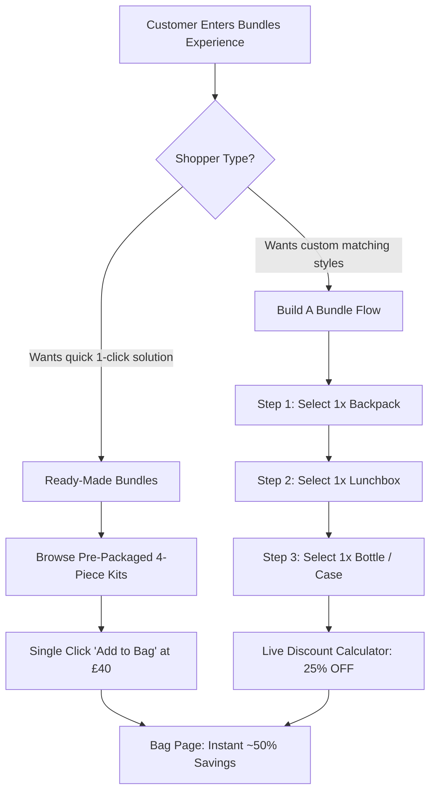

# Smiggle Bundles Deep-Dive: Mechanics, Proportions, Pricing & Structure

This document provides a comprehensive analysis of the bundle architecture used by **Smiggle UK** (`smiggle.co.uk`). Bundles are Smiggle's central sales and Average Order Value (AOV) driver, especially during the Back-to-School season.

---

## 1. The Bundle Navigation Block Directly Under the Hero

On Smiggle's homepage, the most prominent real estate immediately below the main hero slider is dedicated to the **Bundle & Category Tile Block**.

### Tile Structure & Labels (In Order)
1. **Tile 1: `BUILD A BUNDLE`**
   - *Subtext / Pill Badge:* `SAVE 25%`
   - *Destination:* `/bundles/build-a-bundle`
   - *Visual:* Split graphic showing a backpack, lunchbox, and bottle merging into a shopping bag with a vibrant rainbow/pink gradient.
2. **Tile 2: `READY-MADE BUNDLES`**
   - *Subtext / Price Band:* `£30 - £50`
   - *Destination:* `/bundles/ready-made-bundles`
   - *Visual:* Full matching 4-piece character set (Backpack, Lunchbox, Bottle, Hardtop Pencil Case) in cyan `#46bedc` container.
3. **Tile 3: `STATIONERY BUNDLES`**
   - *Subtext / Price Band:* `£25 & UNDER`
   - *Destination:* `/bundles/stationery-bundles`
   - *Visual:* Marker tubs, scented pencil packs, and spiral notebooks in lime green `#8cc63f` container.
4. **Tile 4: `HOT OFFER BUNDLES`**
   - *Subtext / Discount Tag:* `UP TO 50% OFF`
   - *Destination:* `/bundles/hot-offer-bundles`
   - *Visual:* Starburst badge with high-contrast yellow/magenta `#e6007e` background.

### Layout Dimensions & Responsiveness Across Viewports

| Viewport Width | Grid Configuration | Tile Width | Tile Height | Aspect Ratio | Gap | Layout Notes |
| :--- | :--- | :--- | :--- | :--- | :--- | :--- |
| **375px (Mobile)** | `2x2 Grid` or `Horizontal Swipe Carousel` | `165px` | `130px` | ~1.27 : 1 | `12px` | Spans full container with `16px` outer padding; tiles snap horizontally on touch swipe. |
| **768px (Tablet)** | `1x4 Inline Row` (`repeat(4, 1fr)`) | `168px` | `140px` | ~1.20 : 1 | `16px` | Displays all 4 tiles side-by-side without horizontal scrolling. |
| **1440px (Desktop)** | `1x4 Inline Row` (`repeat(4, 1fr)`) | `290px` | `180px` | ~1.61 : 1 | `24px` | Max-width `1280px` container; full hover elevation effect (`translateY(-4px)` with shadow). |

### Visual Hierarchy & Placement Mechanics
- **Price-Band Integration:** Rather than separating category browsing from price promotions, Smiggle bakes round price points (`£30 - £50`, `£25 & UNDER`) directly into the category tile labels.
- **Corner Radii:** Tiles feature smooth rounded corners (`border-radius: 12px` on mobile, `16px` on desktop).
- **Type Placement:** The tile title is rendered in HTML inside a semi-opaque rounded pill banner (`background: rgba(255, 255, 255, 0.95)`, `color: #333333`, `font-weight: 700`) pinned to the bottom of the card.

---

## 2. Live Bundle Products Catalog & Breakdown

Below is the verified catalog of live and recurring bundle products on Smiggle UK, documenting exact component items, list prices (RRP), bundle offer prices, and total savings.

### Standard Bundle Types & Real Examples

| Bundle Product Name | Components Included | Item Count | List Price (RRP) | Bundle Offer Price | £ Savings | % Savings | Target Segment |
| :--- | :--- | :---: | :---: | :---: | :---: | :---: | :--- |
| **Wonder 4-Piece School Bundle** | 1. Classic Backpack (17.5L)<br>2. Double Decker Lunchbox<br>3. Drink Bottle (650ml Tritan)<br>4. Hardtop Pencil Case | 4 | £85.00 | **£40.00** | £45.00 | **52.9%** | Primary / Middle School core back-to-school kit |
| **Express Backpack & Lunchbox Duo** | 1. Classic Backpack<br>2. Double Decker Lunchbox | 2 | £58.00 | **£32.00** | £26.00 | **44.8%** | Value-oriented parents needing essentials only |
| **Giggle 5-Piece Ultimate Bundle** | 1. Junior Backpack<br>2. Lunchbox<br>3. Drink Bottle (450ml)<br>4. Pencil Case<br>5. Mini Scented Stationery Pack | 5 | £70.00 | **£35.00** | £35.00 | **50.0%** | Kindergarten & Junior Primary (Ages 4–7) |
| **Play & Create Art Stationery Tub Bundle** | 1. Scented Gel Pens (30-pk)<br>2. Dual-Tip Marker Tub (24-pk)<br>3. A4 Scented Sketchbook<br>4. Eraser & Sharpener Set | 4 | £42.00 | **£22.00** | £20.00 | **47.6%** | Art, hobby, and birthday return gift buyers |
| **Stitch / Marvel Licensed 4-Piece Bundle** | 1. Character Backpack<br>2. Character Lunchbox<br>3. Character Steel Bottle<br>4. Character Pop-Out Pencil Case | 4 | £95.00 | **£50.00** | £45.00 | **47.4%** | Premium licensed school kit |
| **Essential Study Stationery Bundle** | 1. A4 Notebook 3-Pack<br>2. Ballpoint Pen Pack (10-pk)<br>3. Highlighters (6-pk pastel)<br>4. Geometry / Ruler Set | 4 | £28.00 | **£16.00** | £12.00 | **42.9%** | Pure desk / stationery replenishment |

---

## 3. Price Bands Analysis & Psychological Framing

Smiggle structures its bundles around four distinct, rounded price anchors:

```
┌────────────────────────────────────────────────────────┐
│               SMIGGLE PRICE BAND PYRAMID               │
├───────────────────┬──────────────┬─────────────────────┤
│ Price Band        │ Offer Price  │ Perceived List RRP  │
├───────────────────┼──────────────┼─────────────────────┤
│ Tier 1: Entry     │ £15 – £25    │ £30 – £45           │
│ Tier 2: Core Duo  │ £30 – £35    │ £60 – £70           │
│ Tier 3: Core 4-Pc │ £40 – £45    │ £80 – £90           │
│ Tier 4: Premium   │ £50          │ £95 – £110          │
└───────────────────┴──────────────┴─────────────────────┘
```

### Why This Structure Succeeds
1. **Clear Round Numbers:** Smiggle avoids awkward prices like £38.47 or £41.19. Bundle prices are clean integers (£25, £30, £35, £40, £50), creating immediate cognitive clarity.
2. **The 50% Savings Threshold:** Every bundle is mathematically engineered to deliver between **42% and 53% discount** off individual retail prices. Crossing the "Half Price" mental threshold removes purchase friction.
3. **Threshold Bridge to Free Delivery:** Smiggle's free shipping threshold is **£60+**. A core £40 or £50 bundle places the customer just £10–£20 away from free shipping, naturally encouraging the addition of a £10–£15 stationery tub or pen pack to reach £60+.

---

## 4. "Build A Bundle" vs "Ready-Made Bundles" Mechanics

Smiggle employs two distinct bundling flows catering to different shopper mindsets:



### 1. Ready-Made Bundles (Curated 1-Click Packs)
- **Target User:** Time-pressed parents wanting to solve all Back-to-School requirements in a single transaction.
- **User Flow:**
  1. User selects theme/character (e.g. Gamer, Unicorn, Space, Marvel).
  2. The bundle card presents all 4 matching products together.
  3. Single CTA button: "ADD BUNDLE TO BAG (£40.00)".
  4. Instant cart addition of all 4 SKUs with a pre-applied bundle discount.
- **Discount Ratio:** Higher (~45–53% off list).

### 2. Build A Bundle (Interactive Custom Combinator)
- **Target User:** Children and parents who want to mix-and-match different colors or patterns (e.g. Blue backpack with Green dinosaur lunchbox).
- **User Flow:**
  1. **Step 1 (Bag):** Visual grid of eligible Backpacks with radio select.
  2. **Step 2 (Lunch):** Visual grid of eligible Double Decker / Strap Lunchboxes.
  3. **Step 3 (Bottle / Accessories):** Optional 3rd and 4th items.
  4. **Dynamic Savings Tracker:** A sticky bottom progress bar displays: *"2 of 3 items selected — Add 1 more item to unlock 25% OFF!"*.
- **Discount Ratio:** Slightly lower (flat 25% off combined list price), preserving margin while providing customization.

---

## 5. Bundle Product Detail Page (PDP) Layout

On an individual bundle PDP, Smiggle formats the product presentation to highlight bundle completeness and massive financial savings:

```
┌────────────────────────────────────────────────────────┐
│ [ < Back to Bundles ]                                  │
│                                                        │
│ ┌──────────────────────┐  Wonder 4-Piece School Bundle │
│ │                      │  ★★★★★ (128 reviews)          │
│ │   [Group Photo:      │                               │
│ │    Backpack +        │  ┌──────────────────────────┐ │
│ │    Lunchbox +        │  │ BUNDLE PRICE: £40.00     │ │
│ │    Bottle + Case]    │  │ Was: £85.00              │ │
│ │                      │  │ YOU SAVE: £45.00 (53%)   │ │
│ │   [SAVE 53% Badge]   │  └──────────────────────────┘ │
│ └──────────────────────┘                               │
│ ┌───┬───┬───┬───┐         WHAT'S INCLUDED IN THIS SET: │
│ │ 1 │ 2 │ 3 │ 4 │         ✔ 1x Classic Backpack 17.5L  │
│ └───┴───┴───┴───┘         ✔ 1x Double Decker Lunchbox  │
│ [Thumbnail Strip]         ✔ 1x Drink Bottle 650ml      │
│                           ✔ 1x Hardtop Pencil Case     │
│                                                        │
│                           [   ADD BUNDLE TO BAG    ]   │
│                           ⚡ Fast Dispatch | Free £60+ │
└────────────────────────────────────────────────────────┘
```

### Key PDP Components
1. **Primary Gallery Image:** Displays all items arranged together as an assembled set, showing color matching.
2. **Thumbnail Strip:** 4 individual photos showcasing each component in detail.
3. **Itemized Checklist:** Green checkmarks (`✔`) detailing each item's specific specifications (dimensions, capacity, compartments).
4. **Three-Tier Price Callout:**
   - **Now Price:** `£40.00` in large, bold hot-pink font (`24px`, `#e6007e`).
   - **Was Price:** `£85.00` with strikethrough in muted grey (`16px`, `#888888`).
   - **Savings Pill:** Bright yellow/green pill: `SAVE £45.00 (53% OFF)`.
5. **CTA Button:** Full-width high-contrast button with text `"ADD BUNDLE TO BAG"` or `"GET THIS BUNDLE"`.

---

## 6. Cross-Site Bundle Placements & Merchandising Touchpoints

Smiggle embeds bundle pathways across every layer of the site architecture:

1. **Header Navigation:** "BUNDLES" is positioned as the first primary menu item (leftmost position) and styled with distinctive bold pink text `#e6007e`, standing out against standard dark grey navigation links.
2. **Top Utility Bar:** Displays the free delivery threshold ("FREE DELIVERY £60+"), which interacts directly with bundle pricing tiers.
3. **Homepage Placement:** Placed immediately below the primary hero slider (above standard product category carousels).
4. **Mini-Cart / Drawer Upsell:** When a customer adds a standalone backpack (£38.00) to their bag, an automatic cart drawer notification prompts:
   > *"Add a matching Lunchbox & Bottle for just £12 more to upgrade to the Complete School Bundle (Save £35)!"*
5. **Category Page Banners:** Every category listing (e.g. `/backpacks`) includes a pinned top banner: *"Why buy just the bag? Get the full 4-piece bundle and save 50% →"*.
